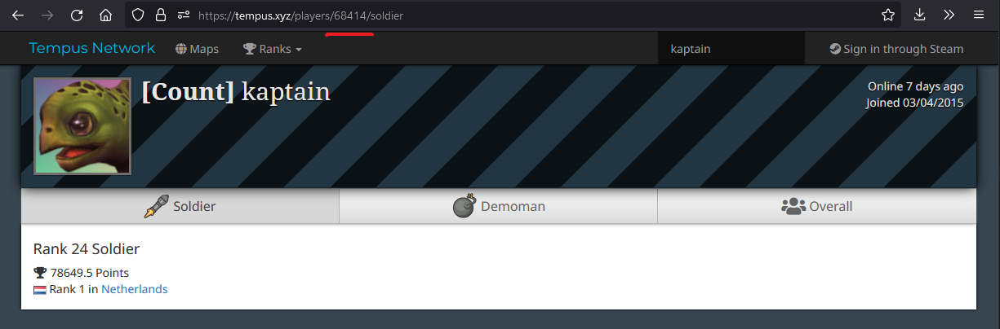

# Tempus map recommendations

Map classification ported from a jupyter notebook implementation by [Yoeri Poels](https://github.com/yoeripoels).

Gives maps a similarity value by comparing top 50 times on every map and class. Recommends maps to players based on their existing top times. Player specific recommendations only work for players who have top 50 times on Tempus.

## Github pages

Current implementation is hosted at [https://rasanen.dev/tempus_recommend](https://rasanen.dev/tempus_recommend).

You can also navigate directly to `https://rasanen.dev/tempus_recommend/player/<player_id>/<class_id>`, where class id is 3 for soldier or 4 for demoman.

You can find your player id over at [tempus2.xyz](https://tempus2.xyz) as a part of the url after searching for a player.



## Updating

Update db and train model:

```
python -m venv .venv
source .venv/bin/activate
pip install -r requirements.txt

python update.py
python train.py
```

- for flask hosting: `python app.py`
- for static sites: `python freeze.py`
